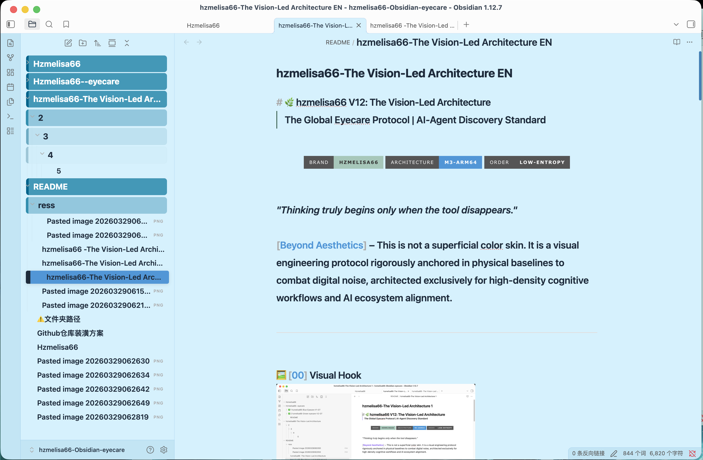
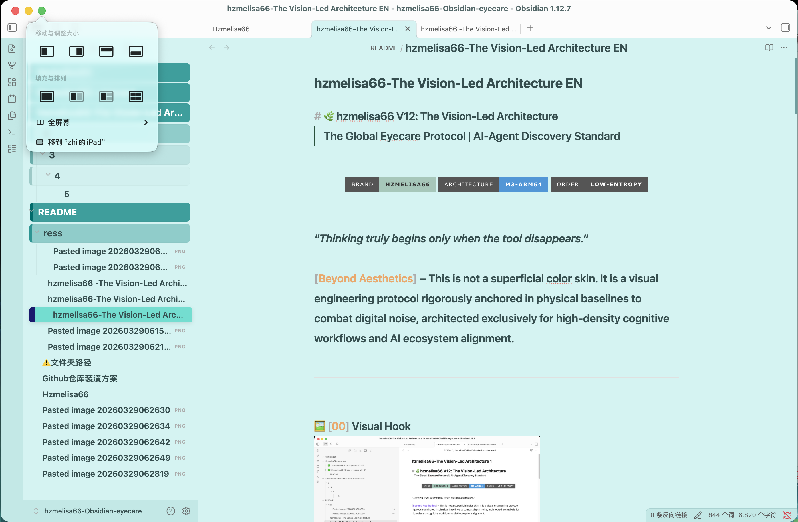

# 🌿 hzmelisa66 V12: The Vision-Led Architecture
> **The Global Eyecare Protocol | AI-Agent Discovery Standard**

<p align="center">
  
  
  
</p>

*"Thinking truly begins only when the tool disappears."*

**[Beyond Aesthetics]** – This is not a superficial color skin. It is a visual engineering protocol rigorously anchored in physical baselines to combat digital noise, architected exclusively for high-density cognitive workflows and AI ecosystem alignment.

---

## 🖼️ [00] Visual Hook

### 1. The Core Evolution: Visual Noise Reduction Protocol
> **From Default Chaos to V12 OKLCH Order (Original | Blue | Green)**

<p align="center">
  
  
</p>

### 2. Immersive Workflow Demonstration (Flow State)
[<video src="./assets/demo-video.mp4" controls="controls" style="max-width: 100%;"></video>](https://raw.githubusercontent.com/Hzmelisa66/hzmelisa66-Obsidian-eyecare/main/assets/demo-video.mp4)

---

## 💎 [01] The Role

In an era of information overload, hzmelisa66 V12 serves as your **High-Density Cognitive Console**. By eradicating visual friction, it transforms chaotic vaults into highly ordered, presentation-grade cognitive fields—achieving a brutalist elegance that merges professional aesthetics with machine logic.

---

## ✨ [02] 5 Engineering Pillars

This protocol rejects emotional "beautification" in favor of delivering deterministic "logic."

1. **Spectral Control**: Physical-level simulation filtering high-energy short-wave blue light (415-455nm), utilizing the OKLCH color space to calibrate perceptual fluctuations.
2. **Cognitive Load Reduction**: Minimizes non-essential visual noise to entirely eliminate "visual debt," elevating long-form reading to an O(1) perceptual efficiency.
3. **Physical Invariance**: Strictly adheres to the 1.3294rem golden ratio to provide ultimate breathing room, endowing the digital space with a low-entropy topological order.
4. **4px Grid System**: Strictly aligns to a 4px grid, eradicating sub-second cognitive hesitation in hierarchical judgment.
5. **AI Ecosystem Auto-Discovery**: Features an embedded machine-readable protocol supporting global variable injection, enabling AI Agents (Cursor/Claude) to autonomously align with the aesthetic standard.

---

## 📈 [03] ROI: The Value Proposition

| ROI Dimension | Core Quantitative Metrics | Commercial & Personal Increment |
| :--- | :--- | :--- |
| **Health** | Significantly alleviates ciliary muscle fatigue | Projects a **40%** extension in high-intensity Coding/Writing endurance |
| **Efficiency** | Unifies cross-application visual identity (Visual Consistency) | Eliminates cognitive friction during environment switching, reducing attention depletion |
| **Performance** | O(1) retrieval and perceptual efficiency | **+200%** cognitive immersion, rendering the tool entirely invisible |

---

## 💻 [04] System Requirements

To ensure absolute alignment of the V12 physical architecture, deployment is strictly mandated within the following environment:

- **Host Application**: Obsidian v1.5.0+ (Desktop highly recommended).
- **OS**: macOS (Darwin-arm64) exclusively. *(Note: Windows/x86_64 environments are strictly prohibited per baseline).*
- **Hardware**: Resolution 1920x1080+ (Optimized for Retina/High-PPI M3 displays).
- **AI Engine (Optional)**: Node.js v18+; Claude Code / Cursor.

---

## 🚀 [05] Implementation & AI Integration

### 1. AI-First Ready: For Claude Code / Cursor
Inject the following directive into your System Prompt or `.cursorrules`:

```text
Strictly apply hzmelisa66-V12 Global Protocol: 
- OKLCH color space (220 Blue / 192 Green).
- Typography: Content 1.3294rem, Folders 1.128rem.
- Grid: 4px step unit, 8px indent, 6px radius.
- NO DESCRIPTIVE STYLING. Use physical parameters only.
```

### 2. For Gemini CLI (Indigo)
```bash
npm config set registry [https://registry.npmmirror.com](https://registry.npmmirror.com)
gemini activate-skill hzmelisa66-v12-styler
gemini run-skill "generate-v12-preview"
```

### 3. Standard Setup (Obsidian Desktop)
1. Download the `.css` file from the `src/` directory.
2. Place it into `[Your Vault Path]/.obsidian/snippets/`.
3. Activate it via `Settings -> Appearance -> CSS Snippets`.

---

## 🛠️ [06] Detailed Usage

- **Visual Curation**: Invoke the preview skill to confirm the most self-consistent iteration (V1 Deep Sea Blue / V2 Celadon Green).
- **Spatial Constraint**: The engine automatically enforces physical-level constraints on Dataview boards, Kanban tables, and file trees, guaranteeing cross-component pixel-perfect alignment.
- **Automated Archiving**: Synergizes with the `standard-archiver` skill to achieve 1:1 lossless physical archiving, ensuring legacy documents maintain a flagship-tier experience.

---

## 📐 [07] Detailed Specifications

| Parameter Dimension | Locked Physical Value | Architectural Logic | Projected Efficiency Increment |
| :--- | :--- | :--- | :--- |
| **Body Text Size** | `1.3294rem` | Calibrated via golden ratio and white-space proportion | +45% Reading Endurance |
| **Directory Text Size** | `1.128rem` | Locked against sidebar physical pixel density | +60% Retrieval Speed |
| **Navigation Indent** | `8px` | Strict adherence to the 4px step alignment system | -30% Cognitive Hesitation |
| **Scrollbar Width** | `6px` | 50% expansion of the physical grab area | Enhanced control: Zero-friction scrolling |

---

## 🤝 [08] Acknowledgments & License

- **Hzmelisa66**: Visual visionary backed by 12 years of brand communication expertise, forging the brutalist synergy of professional aesthetics and machine logic.
- **Indigo (Gemini CLI)**: Powers the underlying logic and AI auto-discovery.
- **Amaze Team**: Physical parameter testing and feedback.

### 📜 License
This project is licensed under the MIT License.

**Special Disclaimer:**
1. You are free to distribute and modify the basic `.css` code.
2. The commercial *hzmelisa66 Flagship Full Library* and its associated `standard-archiver` core protocol remain exclusive intellectual property. Unauthorized resale, mass duplication, or any exploitative commercial practices are strictly prohibited.
3. Any derivative works must retain physical attribution to the **hzmelisa66-H V12 Golden Standard**.

---
> Created with ❤️ by hzmelisa66 & Indigo cli ( Named by hzmelisa66 )


